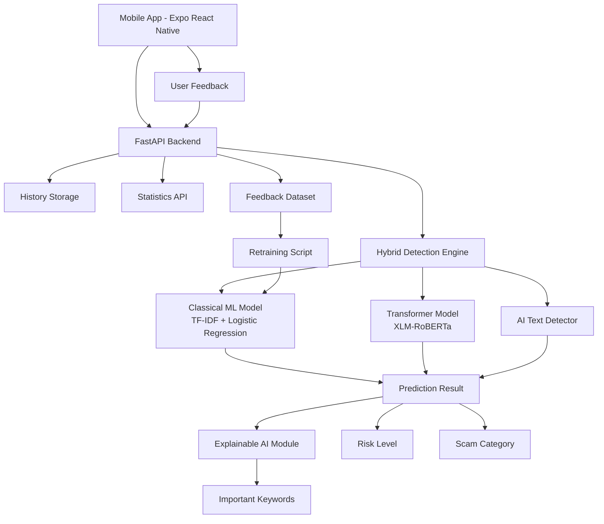

# AI Scam Detector

AI Scam Detector is a hybrid artificial intelligence system for detecting scam, phishing, fraudulent and suspicious messages.

The system combines classical machine learning, transformer-based NLP, explainable AI, user feedback, retraining, statistics and a mobile application.

## Project Goal

The main goal of this project is to build a practical AI-based mobile system that can analyze suspicious text messages and determine whether they are safe or potentially fraudulent.

The system is designed to detect scam messages in multiple languages, explain the prediction result and improve through user feedback.

## Key Features

- Hybrid scam detection system
- Classical ML model using TF-IDF + Logistic Regression
- Transformer-based text classification model
- Hybrid scoring using Classical ML and Transformer scores
- AI-generated text auxiliary detection
- Explainable AI with important keywords
- Explanation text for detection results
- Suspicious indicator extraction
- Scam probability and risk level
- Scam category detection
- Batch message analysis
- Model information endpoint
- Pydantic request and response schemas
- User feedback collection
- Retraining mechanism
- History of analyzed messages
- System statistics dashboard
- Component-based Expo mobile application
- Mobile dashboard with model information
- Multilingual testing: English, Russian and Kazakh

## System Architecture



## Hybrid Scoring

The final scam probability is calculated using a weighted hybrid score:

```text
hybrid_score = 0.6 * classical_ml_score + 0.4 * transformer_score
```

The classical ML model provides fast and efficient text classification, while the transformer model improves semantic understanding. The final decision is based on the combined hybrid score.

The API response includes:

- `classical_ml_score`
- `transformer_score`
- `hybrid_score`
- `explanation_text`
- `suspicious_keywords`

## Project Structure

```text
ai_scam_detector/
├── backend/
│   └── app/
│       ├── main.py
│       ├── services/
│       │   └── retraining.py
│       └── utils/
│
├── ml/
│   ├── classical/
│   │   ├── train_model.py
│   │   ├── predict.py
│   │   ├── scam_model.pkl
│   │   └── vectorizer.pkl
│   │
│   ├── transformer/
│   │   ├── train_transformer.py
│   │   └── scam_transformer/
│   │
│   └── ai_detector/
│       ├── train_ai_model.py
│       ├── ai_model.pkl
│       └── ai_vectorizer.pkl
│
├── data/
│   ├── raw/
│   │   ├── SMSSpamCollection
│   │   ├── phishing_email.csv
│   │   └── AI_Human.csv
│   │
│   ├── processed/
│   │   ├── final_dataset.csv
│   │   ├── feedback_data.jsonl
│   │   └── history.jsonl
│   │
│   └── scripts/
│       └── combine_datasets.py
│
├── mobile/
│   └── scam-detector-mobile-new/
│       ├── app/
│       │   └── index.tsx
│       │
│       └── src/
│           ├── components/
│           │   ├── Hero.tsx
│           │   ├── Tabs.tsx
│           │   ├── ResultCard.tsx
│           │   ├── DashboardView.tsx
│           │   └── HistoryView.tsx
│           │
│           ├── config/
│           │   └── api.ts
│           │
│           ├── data/
│           │   └── examples.ts
│           │
│           ├── styles/
│           │   └── styles.ts
│           │
│           └── types/
│               └── api.ts
│
├── research/
│   ├── model_comparison.py
│   ├── multilingual_test.py
│   └── results/
│
├── docs/
│   ├── diagrams/
│   └── screenshots/
│
├── tests/
├── README.md
└── .gitignore
```

## Backend API

The backend is built with FastAPI.

### Main Endpoints

| Method | Endpoint | Description |
|---|---|---|
| GET | `/` | API status |
| GET | `/health` | Health check |
| GET | `/models/info` | Get information about loaded models and hybrid formula |
| POST | `/analyze` | Analyze a single message |
| POST | `/analyze/batch` | Analyze multiple messages in one request |
| POST | `/feedback` | Save user feedback |
| GET | `/history` | Get recent analyzed messages |
| GET | `/stats` | Get system statistics |

## Example API Response

```json
{
  "text": "Your bank account is blocked. Verify your password now.",
  "scam_prediction": "SCAM",
  "scam_probability": 0.955,
  "confidence": 0.955,
  "risk_level": "HIGH",
  "scam_category": "phishing",
  "classical_ml_score": 0.925,
  "transformer_score": 1.0,
  "hybrid_score": 0.955,
  "important_keywords": ["password", "verify", "account", "blocked", "bank"],
  "suspicious_keywords": ["password", "verify", "account", "blocked", "bank"],
  "explanation_text": "This message was classified as phishing because it contains account, password, verification or blocking-related indicators.",
  "ai_prediction": "NOT ENOUGH TEXT",
  "ai_raw_label": "SKIPPED_SHORT_TEXT",
  "ai_probability": 0.0,
  "model_used": "hybrid_ml_transformer"
}
```

## Batch Analysis Example

```bash
curl -X POST http://127.0.0.1:8000/analyze/batch \
-H "Content-Type: application/json" \
-d '{
  "messages": [
    "Your bank account is blocked. Verify your password now.",
    "Hi, can we meet tomorrow?",
    "Срочно подтвердите данные карты иначе аккаунт будет заблокирован"
  ],
  "save_to_history": true
}'
```

## Scam Categories

The system can classify scam messages into the following categories:

- phishing
- financial fraud
- lottery scam
- social engineering
- fake support
- general scam
- safe

## Explainable AI

The explainability module extracts important keywords from the input message.

These keywords help users understand why the system classified a message as scam or safe.

Example:

```text
Message:
Your bank account is blocked. Verify your password now.

Important keywords:
bank, account, blocked, verify, password
```

## Feedback and Retraining

The mobile application allows the user to mark whether the prediction was correct.

User feedback is saved into:

```text
data/processed/feedback_data.jsonl
```

After collecting feedback samples, the retraining script can update the classical machine learning model.

This allows the system to adapt to new scam patterns.

## Research and Evaluation

The project includes experimental evaluation scripts:

```text
research/model_comparison.py
research/multilingual_test.py
```

The evaluation compares:

- Classical ML model
- Transformer model
- Hybrid approach

Metrics used:

- Accuracy
- Precision
- Recall
- F1-score

## Mobile Application

The mobile application uses a component-based structure:

- `Hero.tsx`
- `Tabs.tsx`
- `ResultCard.tsx`
- `DashboardView.tsx`
- `HistoryView.tsx`

The app provides:

- single message analysis
- batch message analysis
- scam detection result
- hybrid score visualization
- risk level
- scam probability
- scam category
- model information dashboard
- important keywords
- suspicious indicators
- explanation text
- system statistics
- history of checks
- feedback buttons

## Screenshots

<p align="center">
  <b>Mobile Main Screen</b><br/>
  
</p>

<p align="center">
  <b>Scam Detection Result</b><br/>
  
</p>

<p align="center">
  <b>Safe Message Result</b><br/>
  
</p>

<p align="center">
  <b>History</b><br/>
  
</p>

<p align="center">
  <b>Statistics</b><br/>
  
</p>

## How to Run Backend

Create and activate virtual environment:

```bash
python -m venv venv
source venv/bin/activate
```

Install dependencies:

```bash
pip install -r backend/requirements.txt
```

Run FastAPI backend:

```bash
uvicorn backend.app.main:app --reload
```

The backend will be available at:

```text
http://127.0.0.1:8000
```

## How to Run Mobile App

Go to the mobile folder:

```bash
cd mobile/scam-detector-mobile-new
```

Install dependencies:

```bash
npm install
```

Run Expo:

```bash
npx expo start
```

## Important Note for Mobile Testing

If the app is tested in a browser or simulator on the same machine, this URL can be used:

```text
http://localhost:8000
```

If the app is tested on a real phone with Expo Go, replace `localhost` with the local IP address of the computer running the backend.

Example:

```text
http://192.168.1.45:8000
```

## Technologies Used

### Backend

- Python
- FastAPI
- Pydantic
- Scikit-learn
- Transformers
- Pandas
- Joblib

### Machine Learning

- TF-IDF
- Logistic Regression
- XLM-RoBERTa
- AI-generated text detector

### Mobile

- React Native
- Expo
- TypeScript

### Research

- Matplotlib
- Model comparison
- Multilingual testing

## Diploma Relevance

This project demonstrates:

- artificial intelligence in cybersecurity
- NLP-based scam detection
- hybrid machine learning architecture
- explainable AI
- multilingual evaluation
- mobile system implementation
- adaptive learning through feedback
- practical fraud detection use case
