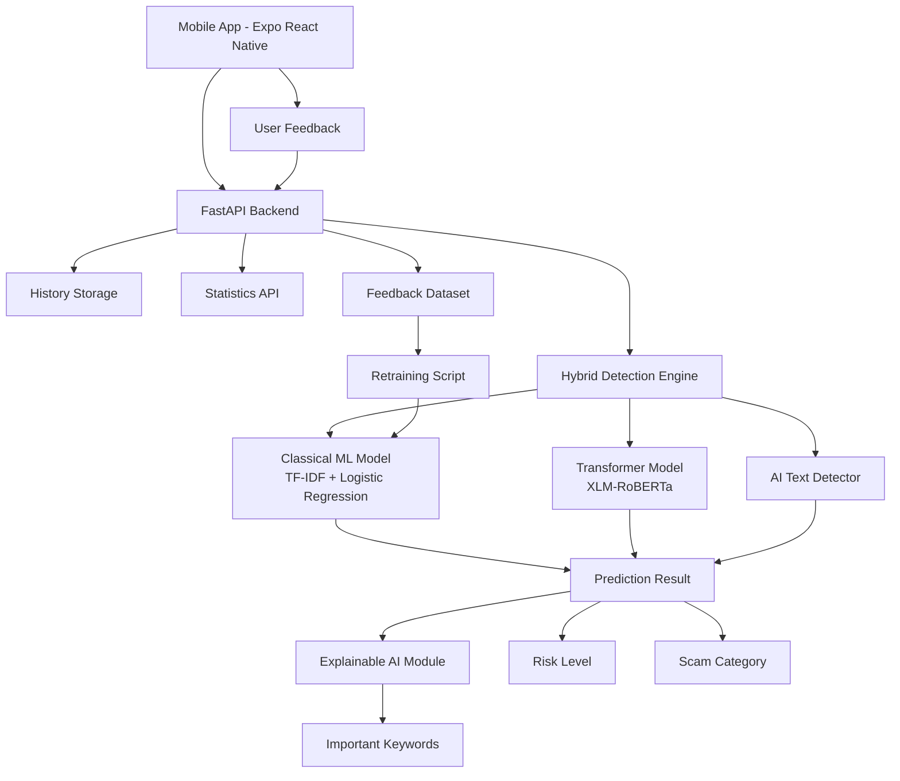
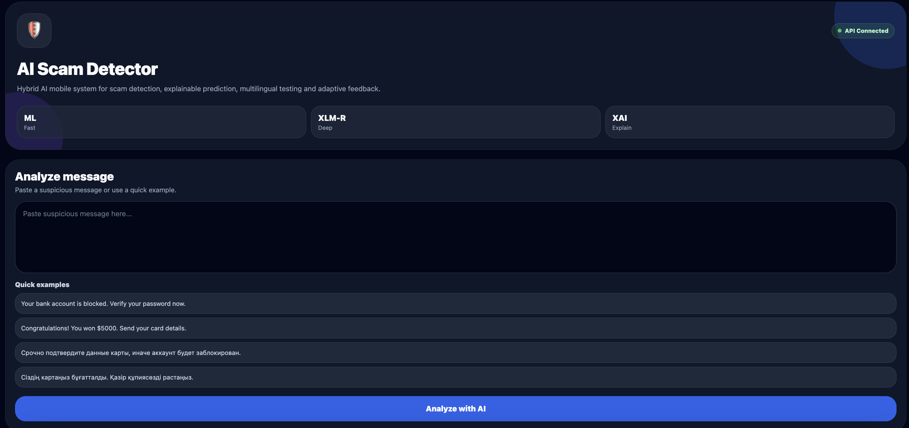
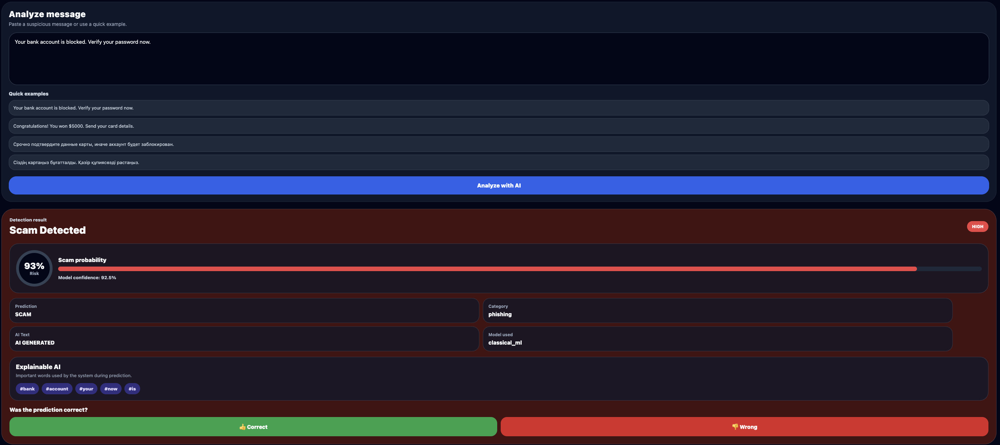
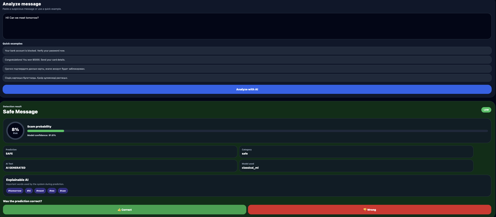
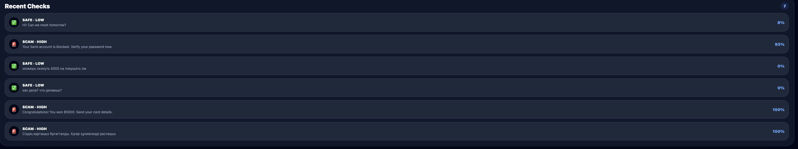
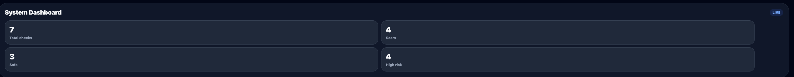

# AI Scam Detector

AI Scam Detector is a hybrid artificial intelligence system for detecting scam, phishing, fraudulent and suspicious messages.

The system combines classical machine learning, transformer-based NLP, explainable AI, user feedback, retraining, statistics and a mobile application.

## Project Goal

The main goal of this project is to build a practical AI-based mobile system that can analyze suspicious text messages and determine whether they are safe or potentially fraudulent.

The system is designed to detect scam messages in multiple languages, explain the prediction result and improve through user feedback.

## Key Features

- Hybrid scam detection system
- Classical ML model using TF-IDF + Logistic Regression
- Transformer-based text classification model
- AI-generated text detection
- Explainable AI with important keywords
- Scam probability and risk level
- Scam category detection
- User feedback collection
- Retraining mechanism
- History of analyzed messages
- System statistics dashboard
- Expo mobile application
- Multilingual testing: English, Russian and Kazakh

## System Architecture



## Hybrid Detection Algorithm

The system uses a hybrid detection approach.

First, the classical machine learning model analyzes the input message using TF-IDF features and Logistic Regression.

If the prediction confidence is high, the system returns the classical model result immediately.

If the confidence is uncertain, the message is passed to the transformer-based model for deeper semantic analysis.

This approach provides a balance between speed and accuracy.

```text
Input Message
     ↓
TF-IDF + Logistic Regression
     ↓
If confidence is high:
     → return prediction
Else:
     → use Transformer model
     ↓
AI text detector
     ↓
Explainability + Risk Level + Category
     ↓
Final Result
```

## Project Structure

```text
ai_scam_detector/
├── backend/
│   └── app/
│       ├── main.py
│       ├── services/
│       │   └── retraining.py
│       └── utils/
│
├── ml/
│   ├── classical/
│   │   ├── train_model.py
│   │   ├── predict.py
│   │   ├── scam_model.pkl
│   │   └── vectorizer.pkl
│   │
│   ├── transformer/
│   │   ├── train_transformer.py
│   │   └── scam_transformer/
│   │
│   └── ai_detector/
│       ├── train_ai_model.py
│       ├── ai_model.pkl
│       └── ai_vectorizer.pkl
│
├── data/
│   ├── raw/
│   │   ├── SMSSpamCollection
│   │   ├── phishing_email.csv
│   │   └── AI_Human.csv
│   │
│   ├── processed/
│   │   ├── final_dataset.csv
│   │   ├── feedback_data.jsonl
│   │   └── history.jsonl
│   │
│   └── scripts/
│       └── combine_datasets.py
│
├── mobile/
│   └── scam-detector-mobile-new/
│       └── app/
│           └── index.tsx
│
├── research/
│   ├── model_comparison.py
│   ├── multilingual_test.py
│   └── results/
│
├── docs/
│   ├── diagrams/
│   └── screenshots/
│
├── tests/
├── README.md
└── .gitignore
```

## Backend API

The backend is built with FastAPI.

### Main Endpoints

| Method | Endpoint | Description |
|---|---|---|
| GET | `/` | API status |
| GET | `/health` | Health check |
| POST | `/analyze` | Analyze message |
| POST | `/feedback` | Save user feedback |
| GET | `/history` | Get recent analyzed messages |
| GET | `/stats` | Get system statistics |

## Example API Response

```json
{
  "text": "Your bank account is blocked. Verify your password now.",
  "scam_prediction": "SCAM",
  "scam_probability": 0.925,
  "confidence": 0.925,
  "risk_level": "HIGH",
  "scam_category": "phishing",
  "important_keywords": ["bank", "account", "password"],
  "ai_prediction": "AI GENERATED",
  "ai_probability": 0.747,
  "model_used": "classical_ml"
}
```

## Scam Categories

The system can classify scam messages into the following categories:

- phishing
- financial fraud
- lottery scam
- social engineering
- fake support
- general scam
- safe

## Explainable AI

The explainability module extracts important keywords from the input message.

These keywords help users understand why the system classified a message as scam or safe.

Example:

```text
Message:
Your bank account is blocked. Verify your password now.

Important keywords:
bank, account, blocked, verify, password
```

## Feedback and Retraining

The mobile application allows the user to mark whether the prediction was correct.

User feedback is saved into:

```text
data/processed/feedback_data.jsonl
```

After collecting feedback samples, the retraining script can update the classical machine learning model.

This allows the system to adapt to new scam patterns.

## Research and Evaluation

The project includes experimental evaluation scripts:

```text
research/model_comparison.py
research/multilingual_test.py
```

The evaluation compares:

- Classical ML model
- Transformer model
- Hybrid approach

Metrics used:

- Accuracy
- Precision
- Recall
- F1-score

## Mobile Application

The mobile application is built with Expo React Native.

The app provides:

- message input
- scam detection result
- risk level
- scam probability
- scam category
- important keywords
- system statistics
- history of checks
- feedback buttons

## Screenshots

<p align="center">
  
  
</p>

<p align="center">
  
  
</p>

<p align="center">
  
</p>

## How to Run Backend

Create and activate virtual environment:

```bash
python -m venv venv
source venv/bin/activate
```

Install dependencies:

```bash
pip install -r backend/requirements.txt
```

Run FastAPI backend:

```bash
uvicorn backend.app.main:app --reload
```

The backend will be available at:

```text
http://127.0.0.1:8000
```

## How to Run Mobile App

Go to the mobile folder:

```bash
cd mobile/scam-detector-mobile-new
```

Install dependencies:

```bash
npm install
```

Run Expo:

```bash
npx expo start
```

## Important Note for Mobile Testing

If the app is tested in a browser or simulator on the same machine, this URL can be used:

```text
http://localhost:8000
```

If the app is tested on a real phone with Expo Go, replace `localhost` with the local IP address of the computer running the backend.

Example:

```text
http://192.168.1.45:8000
```

## Technologies Used

### Backend

- Python
- FastAPI
- Pydantic
- Scikit-learn
- Transformers
- Pandas
- Joblib

### Machine Learning

- TF-IDF
- Logistic Regression
- XLM-RoBERTa
- AI-generated text detector

### Mobile

- React Native
- Expo
- TypeScript

### Research

- Matplotlib
- Model comparison
- Multilingual testing

## Diploma Relevance

This project demonstrates:

- artificial intelligence in cybersecurity
- NLP-based scam detection
- hybrid machine learning architecture
- explainable AI
- multilingual evaluation
- mobile system implementation
- adaptive learning through feedback
- practical fraud detection use case
